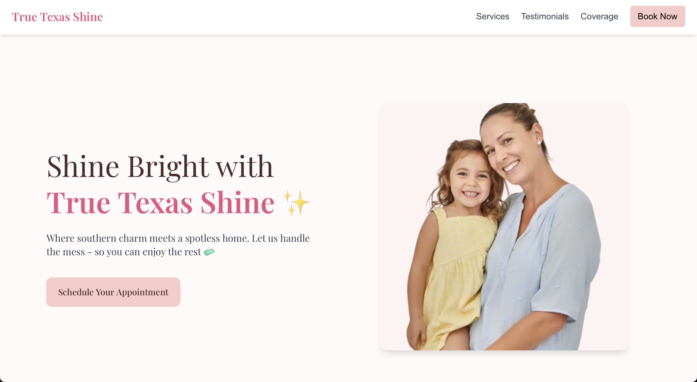
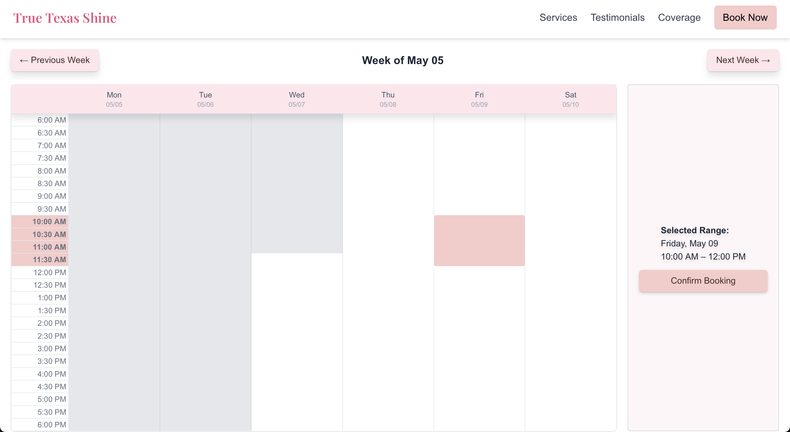

# 🧼 True Texas Shine

**True Texas Shine** is a professional website for a family-owned cleaning business based in Texas. It allows customers to easily book services, learn about the company, and get in touch through a clean, responsive interface.

## 🌐 Live Demo

[https://true-texas-shine.vercel.app](https://true-texas-shine.vercel.app)

## 🚀 Tech Stack

**Frontend**
- Next.js 14 (App Router)
- React
- Tailwind CSS
- TypeScript

**Backend**
- Supabase (Auth + Database)

**Other Tools**
- EmailJS (Contact Form Integration)
- Custom Weekly Calendar (React)
- Hosting: Vercel

## 📸 Screenshots




## ⚙️ Local Setup

```bash
git clone https://github.com/ElGuitarrero/TrueTexasShine.git
cd truetexasshine
npm install
npm run dev